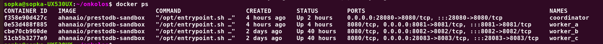
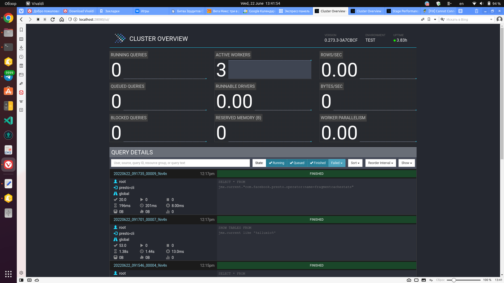

# data-analytics
*Big-Data Server on Presto Architecture*

### What You Will Need:
-------------------------------------------------------------------------------

#### development:
        1.  python3.9
        2.  PostgresDB
        3.  PrestoDB
        4.  Hive 
        5.  Hadoop
        6.  Parquet
        7.  Spark
        8.  git
        9.  Docker
        10. Docker-Compose
        11. Makefile

#### need a GitHub account:
        1. git owner, repository, branch
        2. create a personal access token
        3. create GitHub Actions (CI/CD) and use Actions secrets

#### need an DockerHub account:
        1. Docker Hub
        2. Docker Images

        3. Presto Admin

        
        
        

         

