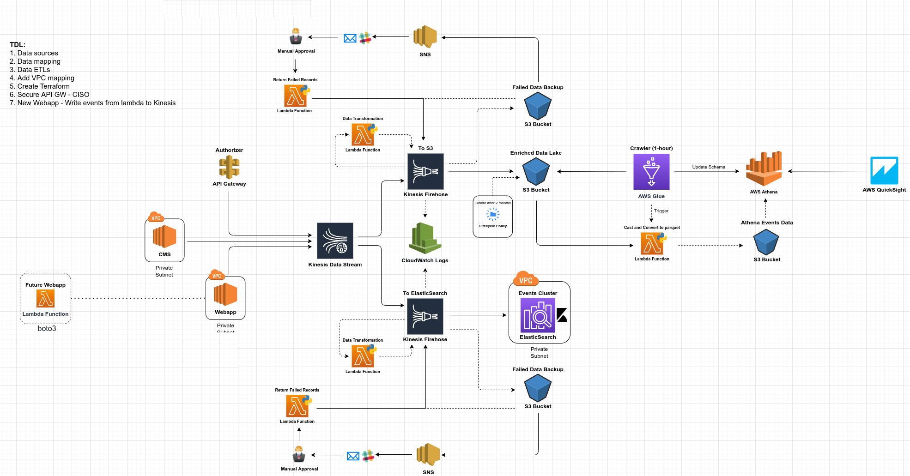

# aws-events- data-analytics

Serverless Architecture on AWS cloud platform for storing and analyzing events data

### What You Will Need:
-------------------------------------------------------------------------------
#### for using the Inretnal REST JSON API's:
        1. create OAuth access tokens
        2. API access root endpoints URLs
        3. investigate APIs Docs Schema for selecting the required:
           - fields, parameters, rate limits, pagination, response statuses, filters
           to compose a correct request to API 

#### need a GitHub account:
        1. git owner, repository, branch
        2. create a personal access token
        3. create GitHub Actions (CI/CD) and use Actions secrets

#### need an AWS account:
        1. an AWS Identity and Access Management (IAM) user with permission to use Amazon SQS, Lambda, 
                and AWS Key Management Service (AWS KMS), AWS Secrets Manager, AWS Glue and Athena and 
                Amazon S3, Amazon EventBridge
        2. create an AWS KMS keys to encrypt each message body using Amazon server-side: 
                Amazon SQS, AWS Secrets Manager, AWS Glue and S3 and Amazon EventBridge
        3. create the secrets in AWS Secrets Manager to store external REST API access tokens(keys) 
                and GitHub personal access token
        4. create Amazon Kinesis Data Streams and two Amazon Kinesis Data Firehoses            
        5. create buckets are containers for data stored in S3 (raw-data, Athena data storage)
        6. create Athena database
        7. create AWS Glue crawler
        8. create Amazon OpenSearch Service and Kibana for elastic search
        

#### development:
        1. python3.9
        2. npm
        3. serverless framework (deploy)
        4. git
        5. awscli
        6. create "~.aws/credentials" with ("aws_access_key_id" and "aws_secret_access_key")
        7. Makefile

